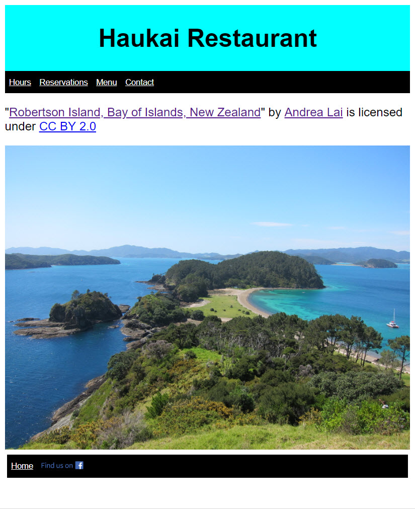
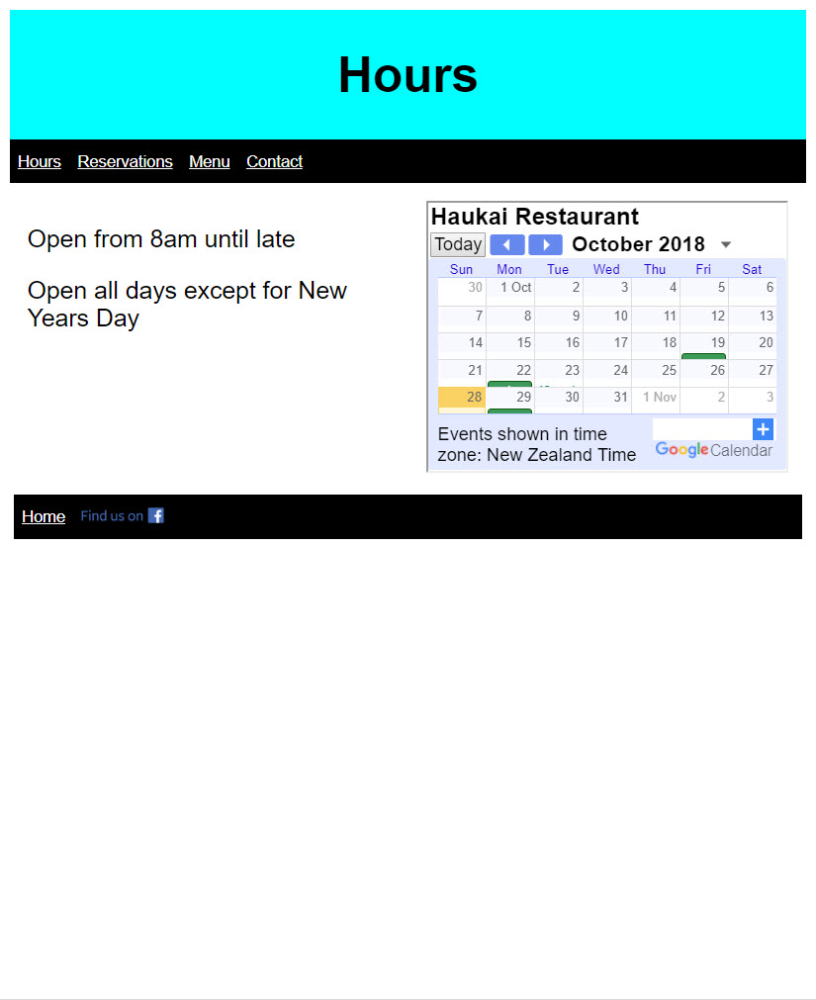
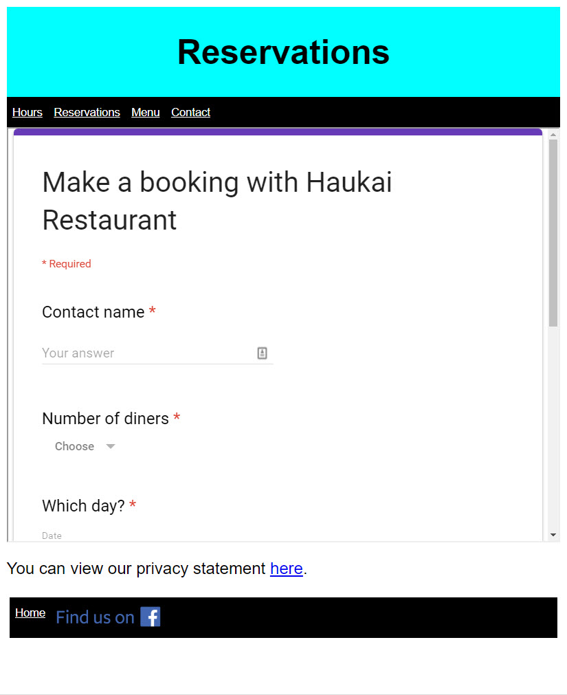
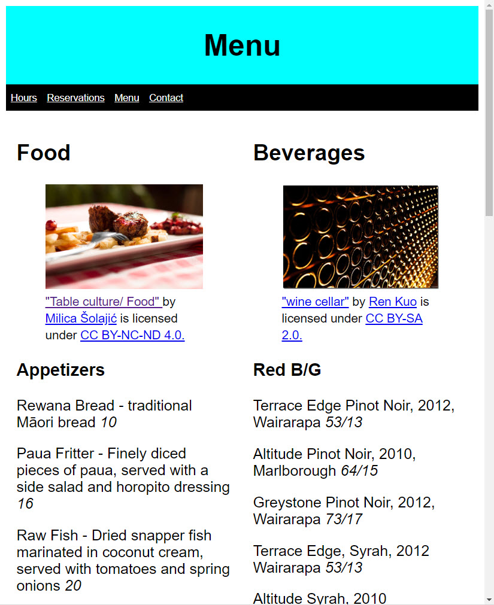
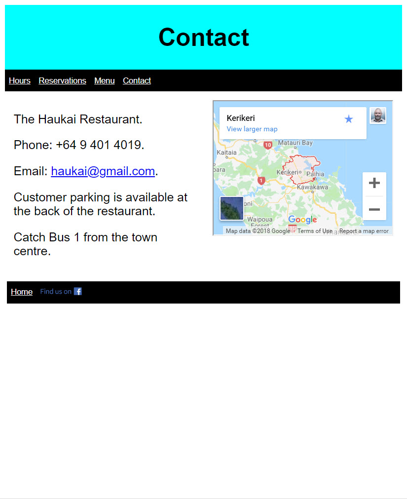
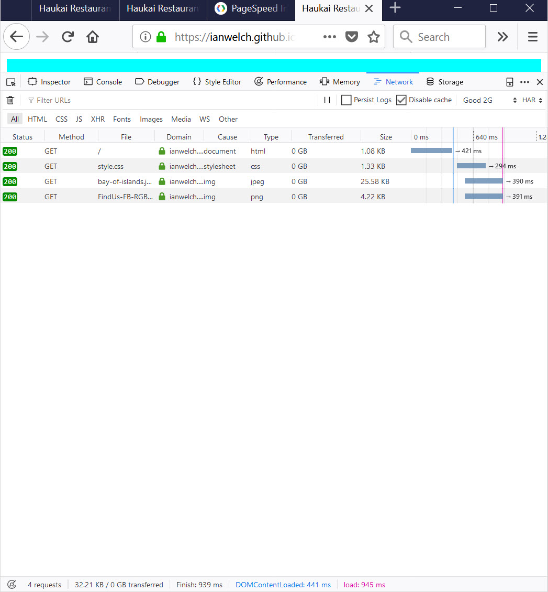

# README

Assignment 2.

## Part 1 Standards, Protocols and security

### a. Uses valid HTML5 to implement web page headers, footers, content, and navigation between the web pages. HTML is validated using https://html5.validator.nu/ Include screenshots of each page.

Note that I have left warnings in related to Aria roles and focused on removing errors.

Home:
- header: hours, reservations, menu and contact
- image of restaurant (with appropriate credit if creative commons)
- footer: link to home page and facebook icon and link

Hours:
- header: hours, reservations, menu and contact
- two columns
- first column - opening hours, Xmas and New Years
- second column - google calendar to show when closed for holidays
- footer: link to home page and facebook icon and link

Reservations:
- header: hours, reservations, menu and contact
- google booking form (number of guests, month, date, time and mobile phone)
- footer: link to home page and facebook icon and link

Menu:
- header: hours, reservations, menu and contact
- two columns
- food with images
- drinks with images
- footer: link to home page and facebook icon and link

Contact:
- header: hours, reservations, menu and contact
- two columns
- phone number, address, email/contact, parking, public transport
- map showing location
- footer: link to home page and facebook icon and link

Navigation:
- header menu allows navigation between pages
- home returns back to the home page

### b. Follows accessibility guidelines where appropriate

Headings are used correctly to organise content:
- Use of H1 instead of using bold or italics for headings.
- Menu is divided up using headers to structure the content.

Includes proper alt text for images:
- Facebook logo on each page.
- Bay of Islands photo on index.html
- Table of food, wine cellar on menu.html

Colour is used with care:
- Chose high contrast colours
- Color is not used as the only visual means of conveying information, indicating an action, prompting a response, or distinguishing a visual element.

Form designed for accessbility (lables, tabbing, grouping):
- Provided by default by Google forms

Tables used for tabular data, not layout:
- Have used div and css instead of tables to layout content

Content can be acessed with keyboard alone in a logical way:
- Checked that can navigate use TAB and arrow keys

ARIA roles and landmarks used to identify naviation menu, header and main content
- Not covered explicitly in the modules
- https://www.washington.edu/accessibility/web/landmarks/ 
- https://www.w3.org/TR/wai-aria/
- added roles "banner", "navigation" and "main" to each page
- turns out these are not necessary for header, nav and main and HTML5 validator will 
  provide a warning that they can be removed

### c. Contains an appropriate privacy statement

Correctness of privacy statement (what, how, applicable laws, purpose, sharing, and contact details)
- Added using privomatic

Additional page added following style of other web pages (layout and navigation)
- Linked from the page where personal information is collected (reservations.html)

## Part 2 Tools and Techniques

### a.	Use GitHub for source control and hosting to enable performance testing and conformance testing by the tutor. You should create a GitHub repository for managing your web application source code and assets. It should be exposed for testing using GitPages.

Appropriately structured repository
- CSS directory, images directory

All assets are placed in appropriate subdirectories with screenshots provided.

### b.	Apply responsive design principles to make the web application mobile ready. We use Google’s mobile-friendly test to automate this testing (https://search.google.com/test/mobile-friendly). 

Viewport is configured to allow browsers to adjust page’s dimension and scaling to suit the device.
- added <meta name="viewport" content="width=device-width, initial-scale=1.0">

Pages can be resized by the user. There’s no reliance on fixed width viewports. 
- yes, tested by resizing

Horizontal scrolling is not necessary to see words or images on the page.
- yes, checked manually

Content is laid out vertically when it won’t fit horizontally within the viewport.
- yes, checked manually

Images scale with the page, or alternative images are used for smaller viewports.
- yes, checked manually 

Fonts are legible for mobile visitors without any need to ‘pinch and zoom’. Fonts scale properly within the viewport.
- initially when tested the font size was too small for the menu page
- increased the font size (the font size is specified using vw)

### c. Optimise page loading times with the aim that the homepage can be loaded within two seconds on a 2G network. All other pages should have their performance optimised as much as possible using appropriate techniques.  We use Chrome DevTools, a mix of manual inspection of code, and Google mobile-friendly test to assess your submission.   

HTML and CSS minified.
- used pagespeed to minify images on homepage and menu 
- minified html and css pages
- kept copies of the unminified versions of the html and css pages

Homepage loads within two seconds over good 2G connection.
- need to reduce the size of the images
- minification required
- tested by disabling caching and setting throttle to Good 2G
- was able to load page within 3 seconds
- (note that the pages with embedded content cannot be optimised easily because
of their reliance on the google services and their loadtimes)

### d.	Discuss how HTTP caching and Content Delivery Networks could further improve responsiveness. Include your discussion in your README file.

HTTP caching occurs when browsers will cache local copies of static web resources such as HTML code or images. This means that the next time the user of the browser visits the same page, the local copies will be loaded without requiring the browser to wait for the resources to be loaded over the network. This improves responsiveness.

HTTP proxies in organisations do the same thing and improve responsiveness for other clients who share the same proxy.

You can apply the same idea to clients who might be spread globally and not users of a shared proxy. Visitors to the site based in different parts of the world will perceive responsiveness differently depending whether they are located close to the server hosting the website. A CDN can be used to distribute copies of the static content to a site located close to the client wanting to visit the site. The idea is that the content will be cached on a CDN server located closer to the client wanting to visit the site. This will improve the overall responsiveness of the wesbite.

